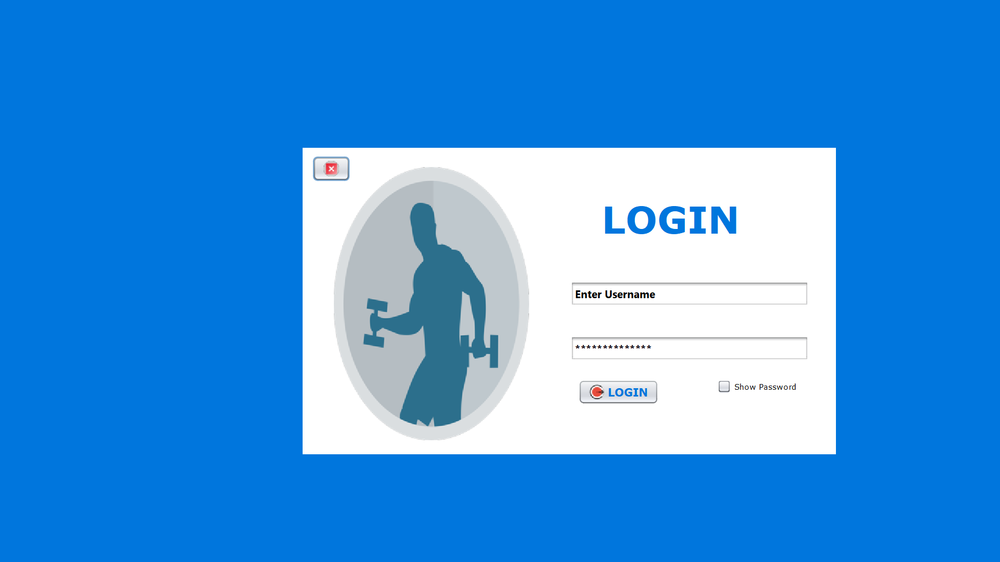

### README.md

```markdown
```

1. Clone the repository:
   ```bash
   https://github.com/Akila-Wasalathilaka/Gym-Management-System-2024.git
   ```

## Features

- **Login System**: Secure login for gym owner.
- **Member Management**: Add, update, and delete members from the system.
- **Payment Processing**: Handle membership and class payments.
- **Home Dashboard**

## Interfaces for Each Section

### Login Interface

The login functionality allows gym staff and members to sign in securely. The login form includes:
- Username - "gms"
- Password _ "admin"
 


### Member Management Interface

This section allows gym administrators to manage member data:
- Add a new member to the gym.
- View and edit existing member details.
- Delete members when needed.

### Payment Interface

Handles payments for gym memberships and classes:
- Payment method selection (Credit/Debit Card, PayPal, etc.).
- Billing information collection.
- Payment confirmation and transaction history.

### Home Dashboard Interface

The home dashboard provides a central hub for managing gym activities:
- View active memberships and payments.
- Access class schedules.
- Manage gym settings and staff details.

## Contribution

Feel free to contribute to this project! Fork the repository, make changes, and submit a pull request.

## License

This project is licensed under the MIT License.


### Next Steps for the Interfaces:

1. **Login Interface**:
   - Build a secure login system for both gym staff and members. For staff, restrict access to management features (like member and payment management).
   
2. **Member Management Interface**:
   - Create forms to add, update, and delete member information (name, contact info, membership status, etc.).

3. **Payment Interface**:
   - Create a form for collecting payment details (credit card, billing address, etc.). Integrate it with payment gateways for processing.

4. **Home Dashboard Interface**:
   - Design a dashboard that shows a summary of gym operations, such as active memberships, upcoming classes, and payment statuses.

